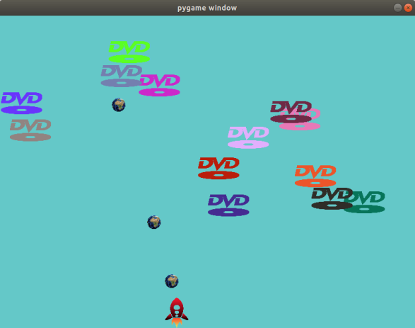

# SimpleGameWrittenInPygame
🎮 Simple game written using the Pygame library.


# Installation

Things you need:
- `python3`
- `pygame`

```sh
$ git clone https://github.com/Kowies/SimpleGameWrittenInPygame
$ chmod +x launcher
```

# Usage

```sh
$ ./laucher
```

# Controls

**ArrowLeft** - fly to the left

**ArrowRight** - fly to the right

**SPACEBAR** - shoot

**q** - turn off the game


# Screenshot



# License

[MIT](LICENSE)

